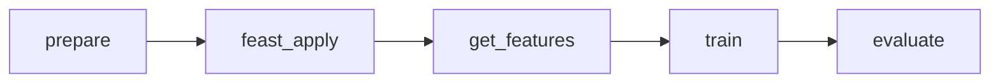

# RetailSmart: Customer Spending Prediction 


## 1. Problem and Dataset

**Problem:** predict how much a customer spends in total (`Total_spent`) from their shopping behaviour and profile.

**Dataset:** `RetailSmart-CustomerBehavior.csv` (100,000 customers, 11 columns, no missing values).

| Group | Columns |
|-------|---------|
| ID | `Customer_ID` |
| Behaviour | `Visits_per_month`, `Avg_spend_per_visit`, `Membership_yrs`, `Complaints_count`, `Satisfaction_Score` |
| Profile | `Age`, `Gender`, `City`, `Is_Loyalty_Member` |
| **Target** | `Total_spent` |

> 

## 2. ML Model

**Random Forest Regressor** (scikit-learn): 100 trees, max depth 10. Trains in under a minute.

- `City` and `Gender` are converted to numbers with fixed mappings (`src/common.py`).
- Train/test split: 80% / 20%, `random_state=42`.
- Hyperparameters live in `params.yaml`.

## 3. Project Structure

```
retailsmart-dvc/
├── data/
│   ├── raw/                 # raw CSV (DVC-tracked via .dvc file)
│   ├── prepared/            # train/test label tables
│   └── training/            # train.csv / test.csv produced by Feast
├── feature_repo/            # Feast feature store
│   ├── feature_store.yaml   # Feast config (registry, offline + online store)
│   ├── features.py          # entity, feature views, feature service
│   └── data/                # feature parquet files, registry.db, online_store.db
├── src/
│   ├── common.py            # shared encoding helper
│   ├── prepare.py           # stage 1
│   ├── feast_apply.py       # stage 2
│   ├── get_features.py      # stage 3
│   ├── train.py             # stage 4
│   ├── evaluate.py          # stage 5
│   └── predict_online.py    # bonus: prediction from the online store
├── models/                  # model.joblib (DVC-tracked)
├── metrics/                 # metrics.json
├── dvc.yaml                 # pipeline definition
├── params.yaml              # parameters
├── requirements.txt
└── README.md
```

## 4. DVC Pipeline



| Stage | What it does | Output |
|-------|--------------|--------|
| `prepare` | Cleans/validates the CSV, writes feature files for Feast, splits labels into train/test | feature parquets, label parquets |
| `feast_apply` | Registers feature definitions and loads the **online store** | `registry.db`, `online_store.db` |
| `get_features` | Retrieves training features from the **offline store** | `train.csv`, `test.csv` |
| `train` | Trains the Random Forest | `models/model.joblib` |
| `evaluate` | Computes MAE, RMSE, R² on the test set | `metrics/metrics.json` |

The whole pipeline is reproduced with one command: `dvc repro`.

## 5. Feast

- **Entity:** `customer` (key: `Customer_ID`).
- **Feature views:** `customer_stats` (behaviour) and `customer_profile` (profile).
- **Feature service:** `spend_model`, the exact feature group the model uses.
- **Offline store** (parquet files): used for *training*. `get_historical_features` joins features onto the labels.
- **Online store** (SQLite): holds the latest value of each feature for fast lookup. `feast materialize` copies data from offline to online. `src/predict_online.py` reads from it to make a prediction.

Training and prediction use the same feature definitions, so they stay consistent.

## 6. How to Run

### Setup

```bash
git clone <your-repo-url>
cd retailsmart-dvc
pip install -r requirements.txt
```

### First-time setup (new repo)

```bash
git init
dvc init
dvc remote add -d storage /path/to/dvc-remote      # a folder, Google Drive, S3, ...
cp /path/to/RetailSmart-CustomerBehavior.csv data/raw/
dvc add data/raw/RetailSmart-CustomerBehavior.csv
git add .
git commit -m "Initial project"
```

### Run the pipeline

```bash
dvc repro            # run all stages
dvc dag              # show the pipeline graph
dvc status           # check whether anything is out of date
dvc metrics show     # show the results
```

### Online prediction (Feast online store)

```bash
python src/predict_online.py CUST000001 CUST000002 CUST000003
```
### Prepare

```bash
%%writefile src/prepare.py
"""Raw CSV -> Feast source parquets + label table."""
import sys
from pathlib import Path

import pandas as pd
import yaml

params = yaml.safe_load(open("params.yaml"))["prepare"]
raw = pd.read_csv(sys.argv[1])

assert raw.Customer_ID.is_unique, "Customer_ID must be unique"
assert raw.isna().sum().sum() == 0, "unexpected nulls"

snapshot = pd.Timestamp(params["feature_timestamp"], tz="UTC")
label_ts = snapshot + pd.Timedelta(days=params["label_offset_days"])

STATS   = ["Complaints_count", "Satisfaction_Score", "Membership_yrs"]
PROFILE = ["Age", "Gender", "City", "Is_Loyalty_Member"]

Path("feature_repo/data").mkdir(parents=True, exist_ok=True)
Path("data").mkdir(exist_ok=True)

for cols, out in [(STATS, "customer_stats"), (PROFILE, "customer_profile")]:
    df = raw[["Customer_ID"] + cols].copy()
    df["event_timestamp"] = snapshot
    df.to_parquet(f"feature_repo/data/{out}.parquet", index=False)

# Labels live OUTSIDE the feature store.
labels = raw[["Customer_ID", "Total_spent"]].copy()
labels["event_timestamp"] = label_ts
labels.to_parquet("data/labels.parquet", index=False)

print(f"features snapshot={snapshot.date()}, labels ts={label_ts.date()}, rows={len(raw)}")
### Share data and model

```bash
dvc push             # upload data/model to the DVC remote
dvc pull             # download them (on a new machine after git clone)
```
### Train

```bash
%%writefile src/train.py
"""Train a Linear Regression model on RetailSmart data (parquet input from Feast)."""
import sys, yaml, joblib
import pandas as pd
from pathlib import Path
from sklearn.compose import ColumnTransformer
from sklearn.pipeline import Pipeline
from sklearn.preprocessing import OneHotEncoder
from sklearn.linear_model import LinearRegression

params = yaml.safe_load(open("params.yaml"))["train"]

train_path = sys.argv[1]
model_out  = Path(sys.argv[2])
model_out.parent.mkdir(parents=True, exist_ok=True)

df = pd.read_parquet(train_path)          # ✅ parquet, not csv

DROP = ["Total_spent", "Customer_ID", "event_timestamp"]
X = df.drop(columns=DROP)
y = df["Total_spent"]

CATEGORICAL = ["City", "Gender"]

pipe = Pipeline([
    ("prep", ColumnTransformer(
        [("cat", OneHotEncoder(handle_unknown="ignore"), CATEGORICAL)],
        remainder="passthrough")),
    ("model", LinearRegression()),
])

pipe.fit(X, y)
joblib.dump(pipe, model_out)
print(f"saved {model_out}")
### Reproduce on another machine

```bash
git clone <your-repo-url> && cd retailsmart-dvc
pip install -r requirements.txt
dvc pull             # get the raw data from the remote
dvc repro            # rebuild everything
```
### Evaluate

```bash
%%writefile src/evaluate.py
"""Evaluate model, write metrics.json."""
import sys, json, joblib
import pandas as pd
import numpy as np
from pathlib import Path
from sklearn.metrics import mean_absolute_error, mean_squared_error, r2_score

model_path   = sys.argv[1]
test_path    = sys.argv[2]
metrics_path = Path(sys.argv[3])
metrics_path.parent.mkdir(parents=True, exist_ok=True)

model = joblib.load(model_path)
df = pd.read_parquet(test_path) if test_path.endswith(".parquet") else pd.read_csv(test_path)
X = df.drop(columns=["Total_spent", "Customer_ID", "event_timestamp"])
y = df["Total_spent"]

pred = model.predict(X)
metrics = {
    "mae":  float(mean_absolute_error(y, pred)),
    "rmse": float(np.sqrt(mean_squared_error(y, pred))),
    "r2":   float(r2_score(y, pred)),
}
with open(metrics_path, "w") as f:
    json.dump(metrics, f, indent=2)
print(json.dumps(metrics, indent=2))
### Experiment

```bash
# edit params.yaml, e.g. train.n_estimators: 200
dvc status           # shows 'train' and 'evaluate' are stale
dvc repro            # re-runs only train + evaluate
```

## 7. Results

Test set (20,000 customers):

| Metric | Value |
|--------|-------|
| MAE | ≈ 0.23 |
| RMSE | ≈ 1.58 |
| R² | ≈ 0.9998 |

